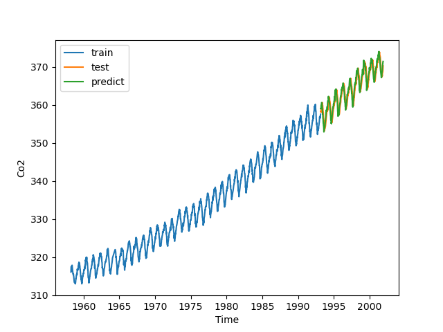
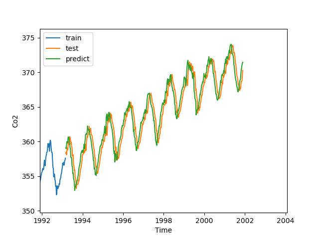

# Dự báo nồng độ CO2 bằng Linear Regression
- Project này xây dựng một mô hình học máy để dự đoán nồng độ CO2 trong khí quyển dự trên dữ liệu chuỗi thời gian (time-series) lịch sử. Mô hình sử dụng thuật toán **Linear Regression** kết hợp với kĩ thuật **cửa sổ trượt (Sliding Window)** để biến bài toán chuỗi thời gian thành bài toán học có giám sát

## Tổng dự án
1. **Tiền xử lý:** xử lý dữ liệu thô, điền các giá trị bị thiếu bằng phương pháp nội suy.
2. **Tạo feature:** tạo dữ liệu đệ quy
3. **Huấn luyện:** sử dụng mô hình hồi quy tuyến tính
4. **Đánh giá mô hình:** kiểm tra độ chính xác của mô hình với tập test tách biệt theo thời gian

## Dữ liệu
Dataset ("Co2.csv") chứa các số liệu đo lường nồng độ Co2 theo tuần
- **Xử lý Missing Data:** cột 'co2' được làm sạch bằng hàm 'interpolate()' (nội suy tuyến tính) để đảm bảo tính liên tục của chuỗi thời gian
- **Khoảng thời gian:** 1958 - 2001

## Phương pháp thực hiện
### 1. Kỹ thuật của sổ trượt 
Hàm 'create_recursive_data()' được sử dụng để chuyển đổi dữ liệu. Để dự đoán nồng độ CO2 tại thời điểm $t$, mô hình sẽ nhìn vào dữ liệu của thời điểm 4 ngày trước đó ($t-4$ đến $t-1$)
- **Window Size:** 5 (4 đầu vào, 1 nhãn dự đoán)
- Các đặc trưng 'co2_1', 'co2_2', 'co2_3', 'co2_4' được tạo ra bằng cách dịch chuyển (shift) dữ liệu để làm đầu vào dự đoán cột 'target'

### 2. Huấn luyện mô hình
- **Thuật toán:** Linear Regression ('sklearn')
- **Chia tập Train/Test:** vì là dữ liệu chuỗi thời gian, nên dữ liệu phải chia theo thứ tự, không được chia ngẫu nhiên
    - **Train:** 80% dữ liệu đầu
    - **Test:** 20% dữ liệu sau cùng (để kiểm tra khả năng dự báo tương lai)
## Kết quả
Mô hình cho thấy khả năng nắm bắt tốt xu hướng tăng trưởng (trend) của dữ liệu CO2.
### Biểu đồ trực quan hóa
*(Đường màu xanh lá là giá trị dự đoán, đường màu cam là giá trị thực tế, đường màu xanh dương là giá trị tập train)*

**Phân tích chung về biểu đồ:** kết quả dự đoán tốt
- **Bắt được xu hướng (Trend Capture)**: Dữ liệu Co2 thực tế (Đường màu cam) có xu hướng tăng dần theo thời gian (Từ ~355 lên ~375). Đường dự đoán bám sát hoàn toàn xu hướng tăng này
- **Bắt được tính mùa vụ:** Dữ liệu CO2 có đặc tính răng cưa rất đều đặn. Mô hình Linear Regression với đầu vào là 4 tuần trước đó *(window_size = 5)* đã học được quy luật rất chính xác 
- **Độ lệch:** khoảng cách lệch giữa đường thực tế và đường dự đoán là rất nhỏ. Điều này báo hiệu sai số Error rất thấp 
### Đánh giá hiệu năng
| Metric | Điểm số (Score) |
|---|---|
| **R2 Score** | 0.9907505918201436 |
| **MAE (Mean Absolute Error)** | 0.3605603788359248 |
| **MSE (Mean Squared Error)** | 0.22044947360346698 |

- Mô hình đạt R2 Score rất cao, chứng tỏ Linear Regression rất phù hợp để mô hình hóa xu hướng tuyến tính
- Chỉ số MAE thấp cho thấy độ lệch trung bình giữa dự báo và thực tế rất nhỏ, đảm bảo độ tin cậy khi áp dụng vào thực tế
- MSE thấp chứng tỏ mô hình hoạt động ổn định, không có những điểm dự báo sai lệch đột biến (Không có ouliers lớn làm lệch mô hình)

